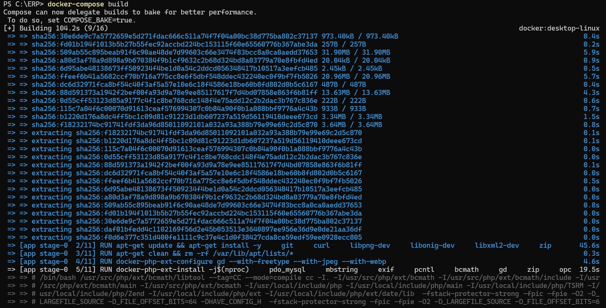
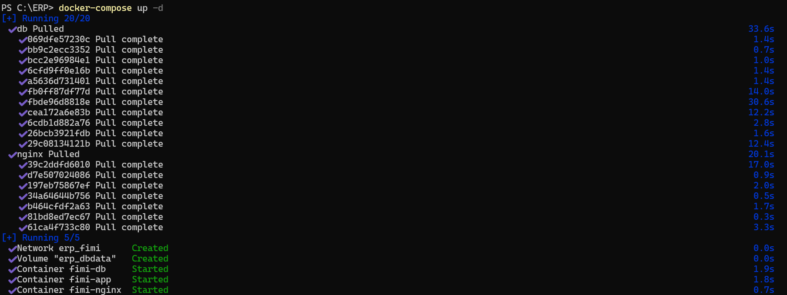
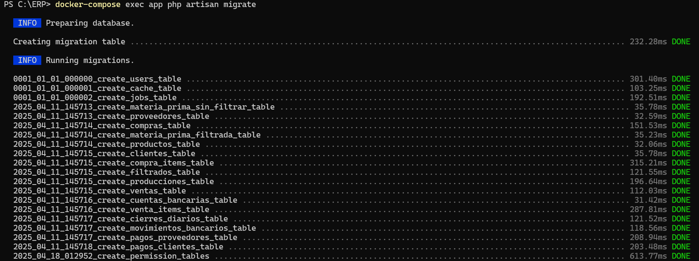
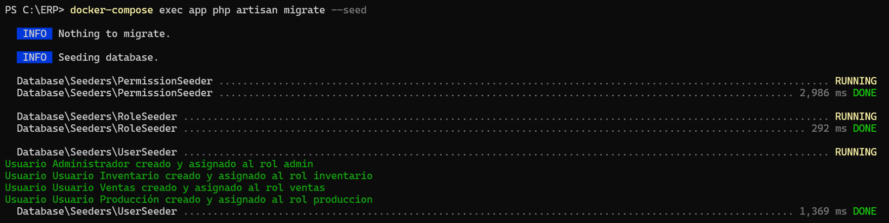
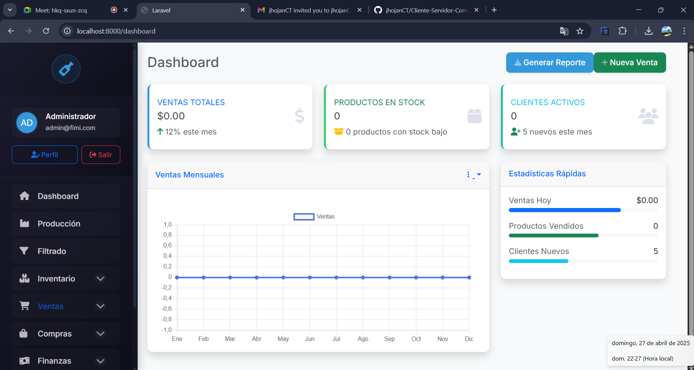

# 📘 Documentación Técnica del Sistema ERP

## 📌 Descripción General

El presente sistema ERP ha sido desarrollado con el objetivo de brindar una solución integral para la gestión empresarial. Utilizando tecnologías modernas y prácticas recomendadas de la industria, el sistema ofrece una plataforma robusta, escalable y fácilmente desplegable. Gracias al uso de contenedores Docker, se asegura una instalación sencilla y un entorno de ejecución estandarizado, minimizando problemas de configuración.

Este sistema fue diseñado bajo los principios de modularidad, escalabilidad y portabilidad, permitiendo su despliegue en ambientes de desarrollo, pruebas o producción con mínimos ajustes.

---

## 🚀 Tecnologías Utilizadas

- 🐘 **PHP 8.3 NTS**  
  PHP es el lenguaje principal utilizado para el desarrollo del backend. Se ha utilizado la versión 8.3 NTS (Non Thread Safe) para optimizar el rendimiento en servidores donde PHP se ejecuta como un módulo separado.  
  ➡️ [Descargar PHP](https://www.php.net/downloads.php)

- 🎯 **Laravel**  
  Framework de PHP utilizado para estructurar el proyecto. Laravel proporciona una arquitectura limpia basada en MVC (Modelo-Vista-Controlador), herramientas de seguridad avanzadas, gestión de rutas, migraciones de base de datos, autenticación, colas, eventos y mucho más.  
  ➡️ [Documentación de Laravel](https://laravel.com/docs)

- 🐬 **MySQL**  
  Sistema de gestión de bases de datos relacional utilizado para almacenar, consultar y gestionar información crítica de manera eficiente y segura.  
  ➡️ [Descargar MySQL](https://dev.mysql.com/downloads/)

- 🐳 **Docker**  
  Herramienta de contenedores utilizada para empaquetar la aplicación junto a todas sus dependencias en un entorno estandarizado.  
  ➡️ [Descargar Docker Desktop](https://www.docker.com/products/docker-desktop)

- 🎨 **Bootstrap**  
  Framework de CSS utilizado para diseñar la interfaz gráfica responsiva de la aplicación, asegurando compatibilidad con distintos dispositivos.  
  ➡️ [Documentación Bootstrap](https://getbootstrap.com/)

---

## 🛠️ Requisitos Previos para la Instalación

Antes de desplegar el sistema, asegúrate de tener instalados los siguientes programas en tu computadora:

| Herramienta | Propósito | Enlace de descarga |
|:------------|:----------|:-------------------|
| **Docker Desktop** | Gestión de contenedores de servicios | [Docker Desktop](https://www.docker.com/products/docker-desktop) |
| **Git** | Clonado de repositorios | [Git Downloads](https://git-scm.com/) |

---

## ⚙️ Procedimiento de Instalación y Despliegue

### 1️⃣ Clonar el Repositorio
Desde tu terminal o línea de comandos, debes clonar el proyecto desde el repositorio remoto:

```bash
git clone [URL_DEL_REPOSITORIO]
cd nombre_del_proyecto
```
Esto descargará todos los archivos del proyecto en tu máquina local.

---

### 2️⃣ Crear el archivo `.env`

Crear el archivo `.env` en la raíz del proyecto y configurar las variables de entorno:

```env
APP_NAME=Laravel
APP_ENV=local
APP_KEY=base64:LeubkOILzMjKnCuKhY4U/dCfYoUf6fFTf/hMVxexzsU=
APP_DEBUG=true
APP_URL=http://localhost

APP_LOCALE=en
APP_FALLBACK_LOCALE=en
APP_FAKER_LOCALE=en_US

APP_MAINTENANCE_DRIVER=file
# APP_MAINTENANCE_STORE=database

PHP_CLI_SERVER_WORKERS=4

BCRYPT_ROUNDS=12

LOG_CHANNEL=stack
LOG_STACK=single
LOG_DEPRECATIONS_CHANNEL=null
LOG_LEVEL=debug

DB_CONNECTION=mysql
DB_HOST=db
DB_PORT=3306
DB_DATABASE=fimi
DB_USERNAME=root
DB_PASSWORD=root

SESSION_DRIVER=database
SESSION_LIFETIME=120
SESSION_ENCRYPT=false
SESSION_PATH=/
SESSION_DOMAIN=null

BROADCAST_CONNECTION=log
FILESYSTEM_DISK=local
QUEUE_CONNECTION=database

CACHE_STORE=database
# CACHE_PREFIX=

MEMCACHED_HOST=127.0.0.1

REDIS_CLIENT=phpredis
REDIS_HOST=127.0.0.1
REDIS_PASSWORD=null
REDIS_PORT=6379

MAIL_MAILER=log
MAIL_SCHEME=null
MAIL_HOST=127.0.0.1
MAIL_PORT=2525
MAIL_USERNAME=null
MAIL_PASSWORD=null
MAIL_FROM_ADDRESS="hello@example.com"
MAIL_FROM_NAME="${APP_NAME}"

AWS_ACCESS_KEY_ID=
AWS_SECRET_ACCESS_KEY=
AWS_DEFAULT_REGION=us-east-1
AWS_BUCKET=
AWS_USE_PATH_STYLE_ENDPOINT=false

VITE_APP_NAME="${APP_NAME}"
```

---

### 3️⃣ Construir los Contenedores Docker

Se debe construir la infraestructura de servicios (PHP, MySQL, etc.) utilizando Docker Compose:
```bash
docker-compose build
```
Este comando genera las imágenes necesarias según las instrucciones del archivo docker-compose.yml.



---

### 4️⃣ Levantar los Servicios

Una vez construidos los contenedores, se deben levantar todos los servicios en segundo plano:
```bash
docker-compose up -d
```
Esto inicia los servicios y permite que la aplicación comience a ejecutarse en el entorno Docker.



---

### 5️⃣ Instalar las Dependencias de Laravel

Dentro del contenedor de la aplicación, se deben instalar todas las dependencias necesarias (framework Laravel y paquetes auxiliares):
```bash
docker-compose exec app composer install
```
Este comando ejecuta composer install dentro del contenedor app.



---

### 6️⃣ Generar la Clave de la Aplicación

Se debe generar una clave única para que Laravel pueda funcionar de manera segura:
```bash
docker-compose exec app php artisan key:generate
```
Esta clave cifra las sesiones, cookies y otros datos sensibles.

---

### 7️⃣ Migrar la Base de Datos

Para construir las tablas y estructuras necesarias en la base de datos, se deben ejecutar las migraciones de Laravel:
```bash
docker-compose exec app php artisan migrate
```
Esto creará automáticamente todas las tablas definidas en los archivos de migración.


---

### 8️⃣ Poblar la Base de Datos

Luego, si el sistema dispone de datos iniciales o registros de prueba, se deben cargar usando los seeders:
```bash
docker-compose exec app php artisan migrate --seed
```
Esto garantiza que al iniciar el sistema se disponga de la información básica para su correcto funcionamiento.



---

### 9️⃣ Acceder al Sistema

Finalmente, se puede acceder al sistema ingresando la siguiente dirección en el navegador:

```text
http://localhost:8000
```
Desde allí, la aplicación estará lista para ser utilizada.



---

## 📈 Configuración de la Base de Datos

| Parámetro | Valor |
|:----------|:------|
| Nombre de la Base de Datos | `fimi` |
| Usuario de Base de Datos | `root` |
| Contraseña de Base de Datos | `root` |
| Host de la Base de Datos | `db` |
| Puerto de Base de Datos | `3306` |

---

## 📄 Consideraciones Adicionales

- **Docker Compose** facilita el levantamiento automático de múltiples servicios relacionados.
- **Laravel** permite una extensión sencilla mediante paquetes y configuraciones modulares.
- **Despliegue Local** optimizado para pruebas y desarrollo (`APP_ENV=local`).
- **Escalabilidad**: el sistema puede crecer modularmente gracias al uso de contenedores.
- **Seguridad**: se recomienda actualizar llaves de entorno y habilitar HTTPS para producción.

---

# ✅ Sistema ERP listo para su ejecución y expansión 🎉🚀

